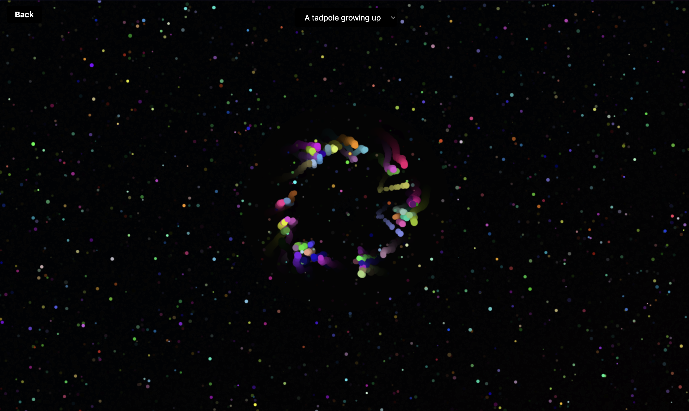

# Music Visualizer

## Project Overview
The Music Visualizer is a reactive webpage that blends audio-reactive visualizations with a simple but modern user interface. This project allows users to experience music in a new dimension by immersing them in visuals that sync with the mood of the music.

## Challenges Encountered
One of the biggest challenges I faced was integrating the Web Audio API with the dynamic visuals. Ensuring smooth performance across devices while syncing the audio with the animations took a lot of tweaking. Additionally, creating a responsive design that worked across different screens was a challenge that required frequent testing and adjustments.

## Features
### Implemented
* Dynamic Background Visualizer: A canvas based animation that reacts to audio to create a mesmerizering background
* Genre Mood Buttons: Buttons that allow users to switch the mood between a beauiful sparkling effect, or they can go for the original type of vibe and look at waves
* Responsive: Responsive design using Tailwind to fit different device layouts
* Web Audio API: We utilized the Web Audio API to speak with the JS and create something beautiful that will be remembered for decades
* Tailwind: We used Tailwind for easy and efficient styling

### To Be Implemented:
* User Customization of Visuals
* Sound Effects for Different Genres

## Technologies
* HTML - Structure the web pages
* Tailwind - Styling and responsive design
* JavaScript - To control interactivity and visuals
## music credits
Relaxing page
- Alternative Outro - Lucki
- Sleep Patterns - Merchant Ships
- My Kind Of Woman - Mac DeMarco
- Heart To Heart - Mac DeMarco
- No Surprises - Radiohead

Ambient page
- A tadpole growing up - [Braden](https://github.com/BPChance) (feat. Hunter Horton)
- Candy Thief - [Braden](https://github.com/BPChance)
- liver and onions - My good friend Hunter, aka the Hort

## Page link
https://bpchance.github.io/Music-Visualizer/

## Authors
Braden Chance [GitHub](https://github.com/BPChance) | [LinkedIn](https://www.linkedin.com/in/bpchance/) | [Portfolio](https://bpchance.github.io/)

Dacoda Takagi [https://github.com/dacods]

## About Me
Hi, I'm **Braden Chance**, a software engineer with a passion for building full-stack applications. I'm constantly learning new technologies to improve my skills. You can connect with me on [LinkedIn](https://www.linkedin.com/in/bpchance/)
, or check out my [Portfolio](https://bpchance.github.io/).
